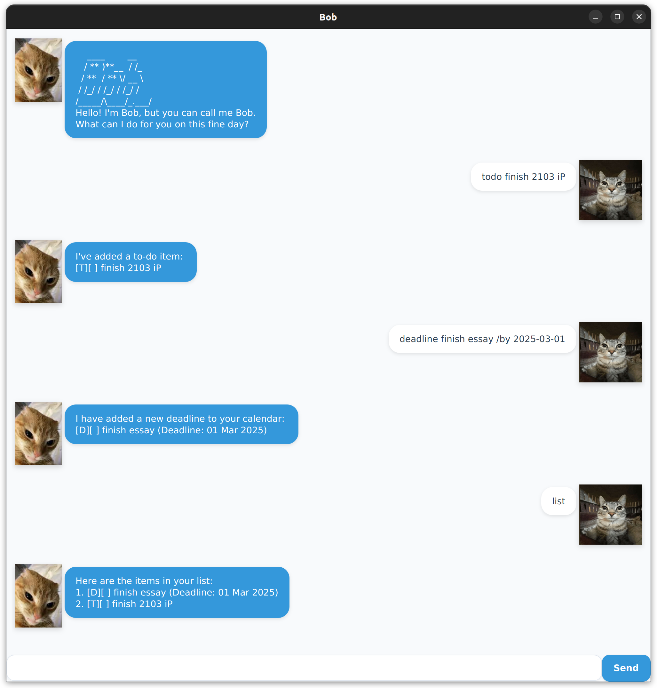

# Bob 🤓 User Guide



> Bob is the best thing ever created! ~ Unknown Unbiased Reviewer

Introducing your new best friend, Bob! Bob helps you to organise your

* Todos
* Deadlines
* Events

It's as easy as

1. Run `java -jar bob.jar`

Bob can **transform** your life. Tick the following once it:

- [ ] makes you more productive
- [ ] makes you less forgetful
- [ ] makes you see the world in every grain of sand

Try Bob [today](https://time.is/)!

It's as easy as

1. Run `java -jar bob.jar`
2. There's no two and three, it's _that_ easy

## Documentation

### 1. Creating Tasks

#### Todo Command

* **Description**: Creates a simple task without any date constraints.
* **Usage**: `todo <description>`

* **Example**:

```
Input: todo finish homework
Output: I've added a to-do item:
[T][ ] finish homework
```

* **Error Cases**:
    - Empty description: "I'm sorry, the description of a to-do item cannot be empty. The proper usage of the todo
      command
      is `todo <description>`. Please try again!"

#### Deadline Command

**Description**: Creates a task with a specific due date.
**Usage**: `deadline <description> /by <due>`
**Format**: Due date must be in YYYY-MM-DD format
**Example**:

```
Input: deadline submit report /by 2025-12-31
Output: I have added a new deadline to your calendar:
[D][ ] submit report (Deadline: 31 Dec 2025)
```

**Error Cases**:

- Invalid format: "I'm sorry, the proper usage of the deadline command is 'deadline <description> /by <due>'. Please try
  again!"
- Invalid date format: "I'm sorry, the date must be in YYYY-MM-DD format. For example: 2025-12-31. Please try again!"

#### Event Command

**Description**: Creates an event with start and end dates.
**Usage**: `event <description> /from <start> /to <end>`
**Format**: Dates must be in YYYY-MM-DD format
**Example**:

```
Input: event team meeting /from 2025-01-01 /to 2025-01-02
Output: I have added a new event to your calendar:
[E][ ] team meeting (Event start: 01 Jan 2025 | Event end: 02 Jan 2025)
```

**Error Cases**:

- Invalid format: "I'm sorry, the proper usage of the event command is 'event <description> /from <start> /to <end>'.
  Please try again!"
- Invalid date format: "I'm sorry, the start/end date must be in YYYY-MM-DD format. For example: 2025-12-31. Please try
  again!"
- Invalid date range: "I'm sorry, the end date cannot be before the start date. Please try again!"

### 2. Managing Tasks

#### List Command

**Description**: Displays all tasks in the list.
**Usage**: `list`
**Example**:

```
Input: list
Output: Here are the items in your list:
1. [D][ ] submit report (Deadline: 31 Dec 2025)
2. [T][ ] finish homework
```

**Error Cases**:

- Using arguments: "I'm sorry, the command 'list' does not take any arguments. Please try again!"
- Empty list: "You have no tasks in your list! Use the 'todo', 'deadline', or 'event' commands to add a task."

#### Find Command

**Description**: Searches for tasks containing specific keywords/phrases.
**Usage**: `find <query>`
**Example**:

```
Input: find report
Output: I found 1 matching task(s), here they are below!
[D][ ] submit report (Deadline: 31 Dec 2025)
```

**Error Cases**:

- Empty query: "I'm sorry, the proper usage of the find command is 'find <query>. Please try again.'"
- No matches: "I'm sorry, no tasks matched with the given query. Please try again with another query."

#### Mark Command

**Description**: Marks a task as completed.
**Usage**: `mark <index>`
**Example**:

```
Input: mark 1
Output: Nice! I've marked this task as done:
[D][✓] submit report (Deadline: 31 Dec 2025)
```

**Error Cases**:

- Invalid index: "I'm sorry, the number of the task to mark must be within 1 and <total_tasks>. Please try again!"
- Already marked: "I'm sorry, the task you are trying to mark as done is already done. You can mark it as undone or
  enter another command!"
- Empty list: "I'm sorry, you have no tasks in your list to mark as done. Please add some tasks first!"

#### Unmark Command

**Description**: Marks a completed task as not done.
**Usage**: `unmark <index>`
**Example**:

```
Input: unmark 1
Output: I have marked this task as not done, get on it!
[D][ ] submit report (Deadline: 31 Dec 2025)
```

**Error Cases**:

- Invalid index: "I'm sorry, the number of the task to mark must be within 1 and <total_tasks>. Please try again!"
- Already unmarked: "I'm sorry, the task you are trying to mark as undone is already not done. You can mark it as done
  or enter another command!"
- Empty list: "I'm sorry, you have no tasks in your list to mark as undone. Please add some tasks first!"

#### Delete Command

**Description**: Removes a task from the list.
**Usage**: `delete <index>`
**Example**:

```
Input: delete 1
Output: I have removed this task from your list:
[D][ ] submit report (Deadline: 31 Dec 2025)
```

**Error Cases**:

- Invalid index: "I'm sorry, the number of the task to delete must be within 1 and <total_tasks>. Please try again!"
- Empty list: "I'm sorry, you have no tasks in your list to delete. Please add some tasks first!"
- Non-numeric index: "I'm sorry, the index of the task to delete must be a number. The proper usage of the delete
  command is 'delete <index>'. Please try again!"

### 3. System Commands

#### Exit Command

**Description**: Saves all tasks and exits the application.
**Usage**: `bye`
**Example**:

```
Input: bye
Output: Goodbye! Have a great day!
```

**Error Cases**:

- Using arguments: "I'm sorry, the command 'bye' does not take any arguments. Please try again!"
